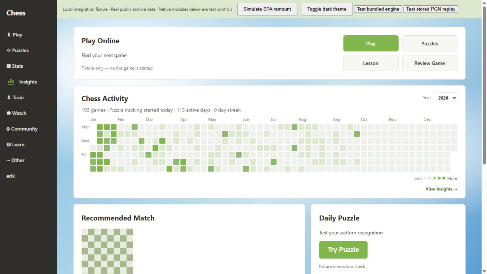
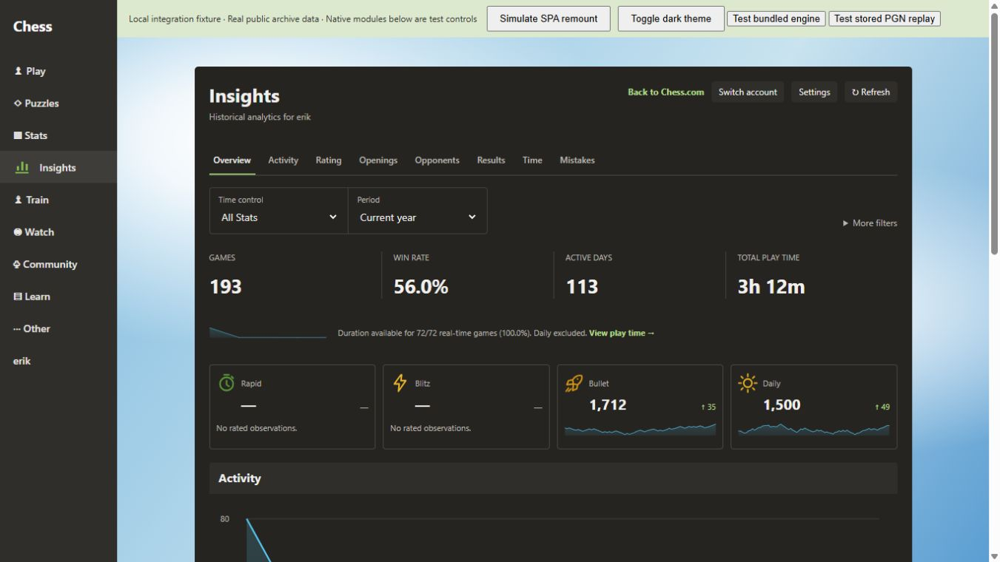

# Chess Insights Final Audit

## 1. Overall status

**NOT RELEASE READY.** Candidate **v0.1.11**, audited October 3–4, 2026
(Asia/Saigon). Baseline: v0.1.10 commit
`a8b7455b9f31ab289266dc76e21eee9fd7cff455`; branch:
`codex/final-release-audit`. Repository remains **PUBLIC**.

Seven confirmed defects are fixed. **381 tests in 59 files PASS**, the independent
verifier passes **1,399 scalar comparisons in four timezones**, and the clean
production build and ZIP checks pass. No stable tag/release was created.
Fixture success does not establish production installation or a completed
independent security scan.

GitHub [CI run 37140873980](https://github.com/phunguyen1006/chess-insights/actions/runs/37140873980)
also passed on implementation commit `e3309b5`: clean dependency install,
typecheck, lint, all tests, four-zone verifier, production build, packaging and
artifact upload. [Recorded CI metadata](audit/reports/ci.json) preserves that
immutable result. [PR #4](https://github.com/phunguyen1006/chess-insights/pull/4)
remains draft until mandatory release gates close.

| Gate | Result | Evidence / limit |
| --- | --- | --- |
| Data integrity / golden / invariants | PASS, tested scope | [CSV](audit/reports/comparison.csv), [summary](audit/reports/verifier-summary.json) |
| Security controls | PASS, limited controls | Manifest, hostile strings, messages, strict credential formats, dependency advisories |
| Independent Codex Security scan | **UNVERIFIED** | [Direct-start failure](audit/reports/security-startup.json); no scan ID/provider context |
| Computational performance | PASS, measured workload | [Before](audit/reports/before-fixes/performance.json) / [after](audit/reports/performance.json); Node/jsdom, not browser profiling |
| SPA lifecycle | PASS, local DOM | [30 cycles / 240 transitions](audit/reports/lifecycle.json) |
| Browser heap / long tasks / actual zoom | **UNVERIFIED** | Retained resources and CSS viewport equivalents are not heap/zoom measurements |
| Functional regression | PASS | [381 tests / 59 files](audit/reports/regression.json) |
| Clean-profile production install | **UNVERIFIED** | Supplied controls expose only in-app browser, not an Edge/Chrome extension-management profile |
| Build / package | PASS, static/package scope | [Build](audit/reports/build.json), [inventory/checksum](audit/reports/hygiene.json) |
| Authenticated DOM / production offscreen engine | **UNVERIFIED** | Requires packaged candidate in the user's Edge profile |

## 2. Audit summary

Confirmed findings: **Critical 0, High 0, Medium 5, Low 2**. All seven fixed;
no confirmed code finding remains open. These counts describe discovered defects,
not a claim that the uncompleted security scan would find nothing.

No product feature, framework, backend, permission, dependency or UI redesign was
added. Database version 4, analysis format 1, Stockfish 18.0.8 and 20,000 nodes per
position remain compatible. Automated storage tests retain 108 older saved
results, reviews and queues while eligibility work is blocked. Actual extension
update/restart preservation remains a mandatory separate check.

Architecture and owners: [docs/DATA-FLOW.md](docs/DATA-FLOW.md).
Gate tracking: [audit/CHECKLIST.md](audit/CHECKLIST.md).

## 3. Independent data verification

The [Python oracle](audit/verifier/independent.py) reads raw records and never
imports extension calculations. The separate
[adapter](audit/verifier/collectExtension.ts) executes the real normalizer,
IndexedDB and analytics under test. [Literal golden controls](audit/fixtures/golden-expected.json)
are hand-counted; the [30-game ledger](audit/fixtures/golden-notes.md) exposes each
record. The generator does not derive expected controls from application functions.
Golden reference clock: October 3, 2026.

Representative comparisons, UTC unless specified:

| Metric | Extension | Independent | Difference | Status |
| --- | ---: | ---: | ---: | --- |
| Completed games | 30 | 30 | 0 | PASS |
| Wins / draws / losses | 14 / 8 / 8 | 14 / 8 / 8 | 0 | PASS |
| Win rate, percent | 46.666666666666664 | 46.666666666666664 | 0 | PASS |
| Rapid / blitz / bullet / daily | 10 / 8 / 6 / 6 | 10 / 8 / 6 / 6 | 0 | PASS |
| Game active days, UTC / UTC+7 | 12 / 14 | 12 / 14 | 0 | PASS |
| Game active days, UTC−5 / New York | 11 / 11 | 11 / 11 | 0 | PASS |
| Games per active day, UTC | 2.5 | 2.5 | 0 | PASS |
| Puzzle attempts | 12 | 12 | 0 | PASS |
| Solved / failed / unknown | 8 / 3 / 1 | 8 / 3 / 1 | 0 | PASS |
| Puzzle active days | 9 | 9 | 0 | PASS |
| Combined heatmap sum | 42 | 42 | 0 | PASS |
| Combined active days, UTC / UTC+7 | 14 / 16 | 14 / 16 | 0 | PASS |
| Current / longest game streak | 4 / 4 | 4 / 4 | 0 | PASS |
| Current / longest puzzle streak | 3 / 3 | 3 / 3 | 0 | PASS |
| Current / longest combined streak | 5 / 5 | 5 / 5 | 0 | PASS |
| Known real-time durations | 22 | 22 | 0 | PASS |
| Recorded time, seconds | 2,530 | 2,530 | 0 | PASS |
| Average known duration, seconds | 115 | 115 | 0 | PASS |
| Rapid / blitz / bullet time, seconds | 550 / 1,160 / 820 | 550 / 1,160 / 820 | 0 | PASS |
| Daily excluded / unavailable real-time | 6 / 2 | 6 / 2 | 0 | PASS |
| Inaccuracies / mistakes / blunders | 2 / 2 / 3 | 2 / 2 / 3 | 0 | PASS |

The CSV also compares weekday/hour buckets, calendar cells, week/month time sums,
ratings/rolling observations by pool, opponent averages, opening W/D/L, ending
reasons, duration distributions and mistake phases. Deterministic counts/duration
sums require **tolerance 0**. Only floating ratios/means/rolling values allow a
documented absolute tolerance ≤`1e-10`. Missing observations remain null.
Win rate includes draws; puzzle success excludes unknown outcomes.

Four isolated zones: UTC, UTC+7 (`Asia/Bangkok`), fixed UTC−5 (`Etc/GMT+5`)
and New York DST. Cases include 23:30/00:30 UTC, midnight, leap day, year rollover,
spring/fall DST, future dates, duplicate IDs, missing ratings, malformed/empty
records. Actual calendar buttons and activity sums are checked independently in
Games/Puzzles/Combined over 2023–2026, including 366 days.

**Time scope:** The raw oracle independently calculates explicit matching PGN
Start/End intervals in the golden. Clock/EMT reconstruction, missing/negative
intervals, timeout/resignation/abandonment, Daily exclusion and sessions have
separate literal regressions and existing real-public-PGN validation. Python
does not independently replay chess or reconstruct every public clock fallback.
Nominal time-control length is never substituted for observed duration.

[Public-user checks](audit/reports/public-check.json): latest monthly archives
of `erik` (3 games), `hikaru` (69), `magnuscarlsen` (20), 43 metric groups ×
4 zones × 3 profiles PASS. Counts, pools, observed ratings, dates, openings,
opponents and endings are compared. These are **not lifetime account audits**;
live archives can grow between fetches. New raw responses are ignored under
`audit/temp/`; committed reports are aggregate only. PubAPI cannot provide
historical puzzle attempts, so synthetic/local tracking and backup tests cover
puzzles. No authenticated session was required.

## 4. Bugs discovered

| ID | Severity | Area | Before fix |
| --- | --- | --- | --- |
| AUD-001 | Medium | Completion validation | Future game: 30→31 games, 42→43 activities, 2,530→2,540 seconds; wrong latest rapid observation |
| AUD-002 | Medium | Large-account heatmap | Repeated sorts/scans produced multi-second calculation/render work |
| AUD-003 | Medium | Error isolation | A view/chart exception removed all Insights controls |
| AUD-004 | Medium | Opening normalization | ECO URL ellipses fragmented families; two public-user comparisons failed |
| AUD-005 | Low | Encoding | Mojibake in chart/fixture labels |
| AUD-006 | Medium | Runtime input validation | Non-boolean settings and unknown actions reached dispatch |
| AUD-007 | Low | Hidden-tab idle work | 12 unnecessary eligibility requests per hidden minute |

## 5. Fixes, root causes and regressions

### AUD-001

- **Severity / area:** Medium, normalization and cached reads.
- **Description / reproduce:** Append the golden far-future completed game; also
  read a legacy cached future row.
- **Expected / actual:** Future completion contributes nothing; before fix it
  changed counts, time and latest rating.
- **Root cause:** Timestamp validation checked positivity/finite Date only.
- **Fix:** Shared `validCompletionTime`, 60-second clock-skew allowance, applied
  on normalization and cached reads without deleting stored history.
- **Regression:** `completionTime.test.ts`, golden/invariants/rendered calendars.
- **Evidence:** [Before CSV](audit/reports/before-fixes/comparison.csv),
  [before summary](audit/reports/before-fixes/verifier-summary.json), final 1,399
  comparisons and full regression PASS.
- **Test maintenance:** Nine old UI failures exposed future synthetic records
  created against the real clock. Two files now use explicit reference clocks
  after their fixture dates; expected assertions and future rejection stay intact.
  [Failure log](audit/reports/before-fixes/regression-clock.txt).
- **Status:** FIXED.

### AUD-002

- **Severity / area:** Medium, activity/puzzle/session work and heatmap.
- **Description / reproduce:** Render 10,000 game days or 50,000 attempts over
  10,000 days.
- **Expected / actual:** Prepare scales once; before fix dataset-sized sorts,
  whole-array month filters and growing membership scans repeated in loops.
- **Root cause:** Dataset work inside per-day/per-session loops.
- **Fix:** Prepared quantiles, Map month groups, weekday day-group counts and
  Set session membership. Formulas and color thresholds retained.
- **Regression:** `heatmapScale.test.tsx`, `auditPerformance.test.tsx`, existing
  puzzle/play-time/session tests and the independent verifier.
- **Evidence:** [Before](audit/reports/before-fixes/performance.json) /
  [after](audit/reports/performance.json). 10k heatmap SSR ≈6,000→148 ms; 50k
  puzzle heatmap SSR ≈8,298→78 ms. Single-run Node measurements.
- **Status:** FIXED.

### AUD-003

- **Severity / area:** Medium, React resilience.
- **Description / reproduce:** Force an Overview chart/view to throw.
- **Expected / actual:** Account/navigation remain usable with fallback; before
  fix the application unmounted.
- **Root cause:** Missing render error boundary.
- **Fix:** Small section/homepage `WidgetBoundary`, Try again fallback; the
  Insights shell remains mounted. Account/section/dataset changes reset it.
- **Regression:** `widgetIsolation.test.tsx`, existing UI regressions.
- **Evidence:** [Before failure](audit/reports/before-fixes/widget-isolation.txt),
  final regression contains the passing fallback/navigation test.
- **Status:** FIXED.

### AUD-004

- **Severity / area:** Medium, openings and legacy metadata.
- **Description / reproduce:** ECO family immediately followed by `...`; load
  an old closed archive with that family.
- **Expected / actual:** Variations share their family; move text previously split
  groups in Hikaru/Magnus comparisons.
- **Root cause:** URL family regex accepted whitespace but not dot/colon
  separators; closed months might never refetch.
- **Fix:** Accept those separators and reparse preserved ECOUrl PGN metadata on
  reads. No refetch, data clearing or analysis-fingerprint change.
- **Regression:** `openingUrlAudit.test.ts`, existing opening/storage tests.
- **Evidence:** [Before public checks](audit/reports/before-fixes/public-check.json),
  [literal failing regression](audit/reports/before-fixes/opening-and-encoding.txt),
  [post-fix public checks](audit/reports/public-check.json) PASS.
- **Status:** FIXED.

### AUD-005

- **Severity / area:** Low, text encoding.
- **Description / reproduce:** Render a chart detail with a middle-dot separator.
- **Expected / actual:** Valid UTF-8; before fix extra misencoded characters.
- **Root cause:** Misencoded source strings.
- **Fix:** Correct separators and fixture glyphs, without layout redesign.
- **Regression:** `chartEncoding.test.tsx`, literal displayed text.
- **Evidence:** [Before failure](audit/reports/before-fixes/opening-and-encoding.txt),
  final regression and inspected fixture views.
- **Status:** FIXED.

### AUD-006

- **Severity / area:** Medium, runtime input correctness.
- **Description / reproduce:** Mock same-extension messages with
  `ci:puzzle-setting enabled: "false"` or an unsupported analysis action.
- **Expected / actual:** `INVALID_REQUEST`; invalid preference/actions previously
  reached settings/analysis dispatch.
- **Root cause:** TypeScript types did not validate runtime messages.
- **Fix:** Validate types/actions, usernames, booleans, themes, years, duration
  actions, puzzle numeric metadata, engine tokens and review fields. Retain sender
  and historical-route guards.
- **Regression:** `requestValidation.test.ts`, puzzle mutations, durations,
  engine authorization and mistake-pipeline tests.
- **Evidence:** [Before](audit/reports/before-fixes/request-validation.txt), final
  regression PASS. Review-grade validation already existed; this finding does
  not claim NaN grades were stored.
- **Calibration:** No externally reachable exploit demonstrated; no arbitrary
  execution claim.
- **Status:** FIXED.

### AUD-007

- **Severity / area:** Low, hidden-tab requests.
- **Description / reproduce:** Hide a mounted preview, advance 60 seconds.
- **Expected / actual:** No recurring eligibility request; previously 12.
- **Root cause:** Five-second interval lacked a visibility guard.
- **Fix:** Skip hidden polls, refresh on return, remove the matching timer and
  visibility listener on unmount. One initial snapshot remains allowed.
- **Regression:** Both `analysisVisibility.test.tsx` tests check hidden/visible
  counts and cleanup; existing state/UI tests pass.
- **Evidence:** [Before](audit/reports/before-fixes/hidden-polling.txt), final
  regression and post-fix independent verifier PASS.
- **Status:** FIXED.

Before-fix logs are retained; machine-local workspace paths were replaced with
`$WORKSPACE`. Final values were recalculated, not copied into before reports.

## 6. Security and privacy

- **Permissions:** `storage` for settings/signals; `offscreen` for local engine.
  Only www/api Chess.com hosts, content matching www. No cookies/history/webRequest,
  all-URLs, optional permissions, web-accessible resources or externally-connectable.
  [Manifest controls](audit/reports/manifest-controls.json).
- **Execution:** CSP self scripts/local WASM, no script unsafe-eval. App and bundled
  Stockfish have no direct eval/new Function or HTTP executable import. Engine
  assets, GPL notices and exact corresponding source are local.
- **XSS:** Hostile external player/opening strings remain escaped in actual SSR
  tests. Production sidebar `innerHTML` uses a fixed source SVG and literal label;
  fixture HTML is excluded from production.
- **Messages:** Known payloads/actions and same-extension sender guards are tested.
  Offscreen ownership is bound to historical tab/run token; live/puzzle contexts
  cannot start historical analysis in tests.
- **Storage:** Account-keyed PGNs remain necessary for local replay/duration.
  Games, puzzles, analyses/reviews/settings stay local. No auth cookie/token/
  password storage or private endpoint. Internal ownership tokens are leases,
  not Chess.com credentials. Backup/CSV is local.
- **Secrets/package:** [Hygiene](audit/reports/hygiene.json): zero strict-format
  credential matches in checked working text, 313 reachable unique Git text
  blobs, and package text. This bounded check is not exhaustive secret detection.
  ZIP excludes .env/.git/node_modules/audit datasets/screenshots/logs/sourcemaps/
  debug markers. New raw public responses are ignored, never packaged.
- **Dependencies:** [Registry audit](audit/reports/dependencies.json): **0 known
  vulnerabilities**, 319 dependency entries. No versions updated. Runtime
  React/React DOM/chess.js are bundled; Stockfish is pinned with source. Dev
  tooling/platform packages are not shipped as node_modules. No claim about
  undisclosed vulnerabilities or long-term package maintenance.

**Independent security remains UNVERIFIED.** Provider response:
“The selected scan target changed while the scan was starting. Try again.”
No scan ID/context returned. The `security-scan` skill requires surfacing this
failure and prohibits a replacement scan. No substitute or fabricated provider
report was produced; the above limited controls do not close that gate.

## 7. Performance, network and memory

Final single-run Node/jsdom workload:

| Records | Normalize | Duration parsing | Aggregation | Heatmap SSR |
| --- | ---: | ---: | ---: | ---: |
| 1,000 games | 10.4 ms | 491.6 ms | 46.1 ms | 95.0 ms |
| 5,000 games | 47.5 ms | 3,366.9 ms | 188.3 ms | 99.7 ms |
| 10,000 games | 114.7 ms | 8,096.5 ms | 236.5 ms | 148.3 ms |
| 50,000 puzzles / 10,000 days | — | — | 152.0 ms | 78.4 ms |

These measure computations and server rendering, not browser initial load,
layout/frame time or long tasks. Runtime parsing already yields small batches.
Node heap snapshots ≈64/64/88 MiB are not controlled GC/retained browser heap;
they cannot prove no leak. Browser initial load, long tasks and real Slow-3G
throttling remain unmeasured.

- **SPA:** 30 cycles Home→Play→Live→Review→Profile→Stats→Home→Insights,
  240 transitions. Correct root/menu counts, one page MutationObserver, at most
  two ResizeObservers, zero settled page timers, no extra reconciliation in
  60 seconds idle. Disposal leaves zero roots/observers/timers and removes matching
  window callbacks. Actual DOM integration + React heatmap in jsdom, not all
  production widgets/retained browser objects simultaneously.
- **Archives:** Whole monthly arrays, not numbered pages. 0/1/49/50/51/1k/5k
  cases and multi-year regressions pass. Game IDs upsert once; attempt IDs dedup
  rerenders but distinguish legitimate repeated puzzles. Ratings derive from unique
  games; mistake identities include account/game/ply.
- **Network:** Serialized, credentials omitted, configured 20-second abort signal.
  429 has ≤4 attempts, waits capped at 25 seconds; 500/DNS recovery, 404/offline/
  malformed JSON covered. Timeout test checks configuration, not a real hung
  20-second connection. Partial failure retains cached history and reports error.
- **Races/cache:** Three concurrent mocked sync callers coalesce the same account
  and isolate another. Hook generation/sequence rejects stale account/queue replies.
  TTL, fingerprints, partial writes, settings merges and additive migrations tested.
- **Three fixture tabs:** One actual Insights root/sidebar each; matching account
  summary and broadcast theme updates. Not installed-MV3 three-tab worker proof.

## 8. Responsive checks and remaining risks

[Browser report](audit/reports/browser-fixture.json): **48 Home/Overview samples**
in both themes at requested screen sizes (1920×1080, 1366×768, 1280×720) using
effective CSS viewports for 80/100/125/150%. **Actual browser zoom/DPR was not
changed.** No document horizontal overflow or home placement failure. Heatmap
equals combined Recommended Match + Daily Puzzle width within 0.015625 CSS px
rounding, below Play Online and above the row. Green/white Home and dark Insights
were visually inspected.

Keyboard: ArrowRight January 1→8, date/count label and tooltip on focus, Enter
opens Activity `date=2026-01-08`. Existing UI tests cover semantic buttons,
summaries, empty/loading/error states and tooltips. Quick check, not WCAG certification.





Outstanding mandatory work before stable:

1. Successful independent security scan and disposition of its findings.
2. Install **this production candidate** in a clean Edge/Chromium profile; test
   first-run, navigation, reload, browser close/open and extension update.
3. Actual authenticated homepage/sidebar geometry, puzzle completion capture and
   three-tab worker coordination in Edge. Authentication stays in the user's
   browser; development fixture requires none.
4. Production offscreen Stockfish delivery/pause/resume and saved-result retention.
   Real WASM fixture self-test passed worker/WASM/UCI/ready and legal best move;
   it is not a production offscreen test.
5. Browser heap across 20–30 loops, retained detached nodes, initial load/long tasks,
   actual Slow-3G and real browser zoom.

Keep the existing extension folder/identity when updating. Do not uninstall or
clear storage for this audit; puzzle backup does not contain analyses/reviews.

## 9. Files changed

Runtime fixes:

```text
src/shared/dates.ts
src/shared/requestValidation.ts
src/data/normalize/normalizeGame.ts
src/data/normalize/normalizeOpening.ts
src/data/storage/gameRepository.ts
src/analytics/activity.ts
src/analytics/puzzles.ts
src/analytics/playTime.ts
src/background/serviceWorker.ts
src/content/chessComContent.tsx
src/features/heatmap/ActivityHeatmap.tsx
src/features/insights/InsightsApp.tsx
src/features/insights/components/WidgetBoundary.tsx
src/features/insights/components/Charts.tsx
src/features/state/useAnalysis.ts
src/dev/fixture.ts
```

Candidate/build: `package.json`, `package-lock.json`, `public/manifest.json`,
`.github/workflows/ci.yml`, `.gitignore`, `eslint.config.js`.
Docs: `README.md`, `CHANGELOG.md`, `docs/INSTALL.md`, `docs/DATA-FLOW.md`,
this report, `audit/README.md`, `audit/CHECKLIST.md`.

Fixtures: `audit/fixtures/{make_golden.py,golden-user.json,golden-expected.json,golden-notes.md}`.
Verifier: `audit/verifier/{independent.py,collectExtension.ts,run.mjs,publicCheck.ts,hygiene.py}`.
Evidence: linked JSON/CSV, before-fix failures and two inspected screenshots in
`audit/reports/`. New raw API responses/local runtime bundles/logs are ignored,
not release assets.

## 10. Tests added and modified

**32 new tests in 13 files**, 349 baseline→381 total:

| Test file | Checks |
| --- | --- |
| `tests/auditGolden.test.tsx` | Actual storage/analytics vs raw oracle, invariants, calendar counts (3) |
| `tests/completionTime.test.ts` | Future/invalid/skew and legacy cached reads (2) |
| `tests/auditLifecycle.test.tsx` | 30-loop roots/menu/observer/listener/timer cleanup (1) |
| `tests/auditPerformance.test.tsx` | 1k/5k/10k games, 50k attempts (1) |
| `tests/auditNetwork.test.ts` | Bounded 429, failures, timeout/credentials/queue (3) |
| `tests/heatmapScale.test.tsx` | Literal quantiles, bounded sorts (2) |
| `tests/widgetIsolation.test.tsx` | Throw preserves shell and fallback (1) |
| `tests/auditArchives.test.ts` | Seven sizes, three-tab isolation, partial failure (9) |
| `tests/auditReleaseControls.test.tsx` | Manifest and hostile string escaping (2) |
| `tests/openingUrlAudit.test.ts` | Ellipsis families, legacy repair (2) |
| `tests/chartEncoding.test.tsx` | UTF-8 readout (1) |
| `tests/requestValidation.test.ts` | Invalid payload/action/sender (3) |
| `tests/analysisVisibility.test.tsx` | Hidden/visible polling and cleanup (2) |

`playTimeActivityUi.test.tsx` and `ratingRedesign.test.tsx` now fix their clock;
their existing assertions and test cases remain intact.

Reproduce:

```sh
npm ci
npm run typecheck
npm run lint
npm test
npm run audit:data
npm run build
npm run release:pack
python audit/verifier/hygiene.py
```

Python 3.9+ needs IANA zone data (Ubuntu CI provides it; Windows can use tzdata).
Final local full suite used one worker to limit contention. CI runs its configured
command and independent verifier.

## 11. Final release checklist

Checked entries mean tested within the stated scope.

- [x] Data integrity
- [x] Golden dataset
- [x] Independent verifier
- [x] Timezone
- [x] Heatmap
- [x] Time Played
- [x] Pagination
- [x] Deduplication
- [x] SPA navigation — local DOM/fixture; authenticated integration pending
- [ ] Security — provider scan did not start
- [x] Dependency audit
- [ ] Performance — computations PASS; production browser profile pending
- [ ] Memory — resource cleanup PASS; browser heap pending
- [ ] Clean install
- [x] Production build — build/static/ZIP checks; installation separate
- [x] Regression

Outputs: `dist/`, `releases/chess-insights-v0.1.11.zip`,
`releases/SHA256SUMS.txt`. ZIP **6,513,615 bytes / 23 entries**. SHA-256:

```text
33942d4c181ccd59cecdf3cbea5788b8e6e6edf4fd243e27c1725dead3a5f30f
```

No stable tag until independent security, clean-profile and actual production
browser checks pass. Local fixture success alone does not close these gates.
