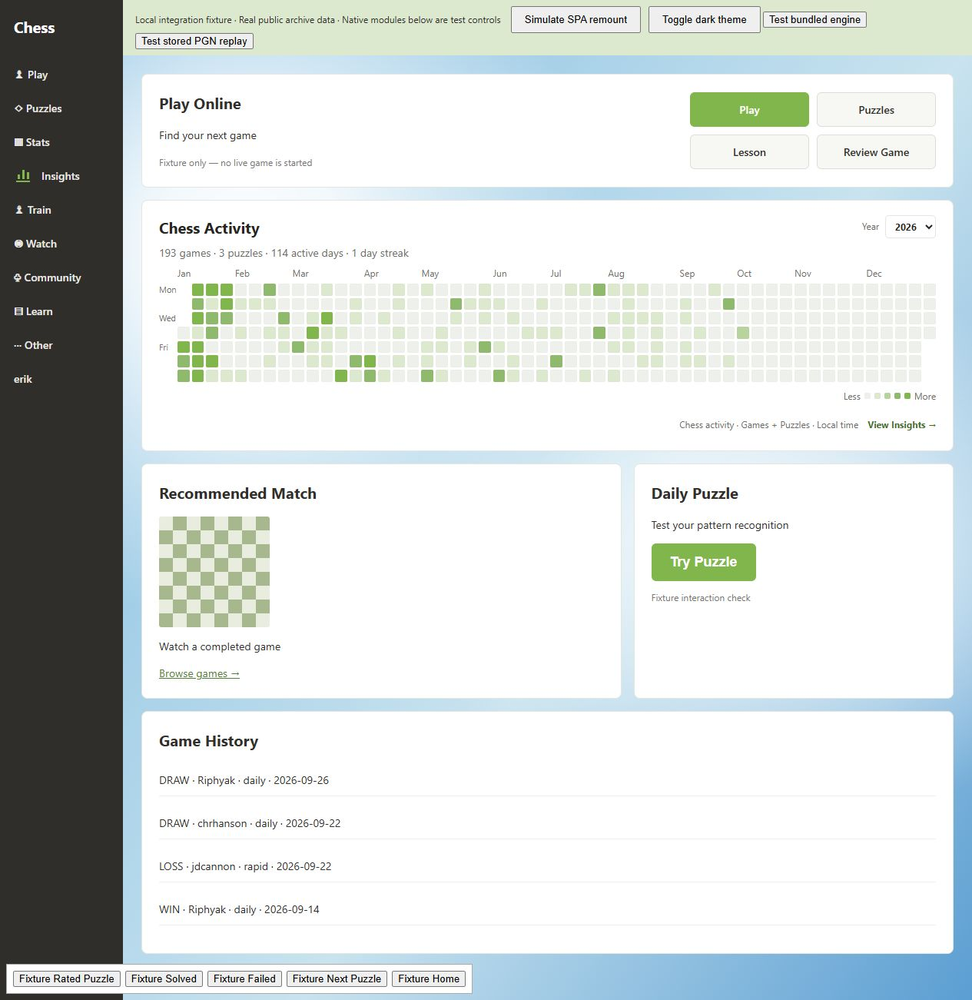
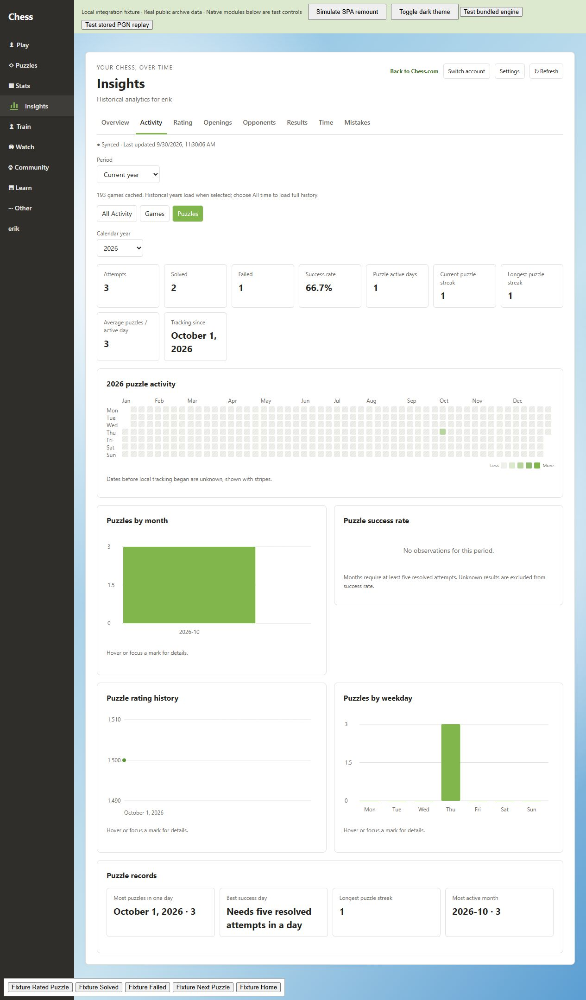

# Chess Insights

[](https://github.com/phunguyen1006/chess-insights/actions/workflows/ci.yml)
[](LICENSE)

A standalone Chrome / Edge extension for Chess.com activity analytics, locally tracked rated puzzles, and on-demand review of completed games. Independent community software; not an official Chess.com product.

## Install

Download **[chess-insights-v0.1.7.zip](https://github.com/phunguyen1006/chess-insights/releases/download/v0.1.7/chess-insights-v0.1.7.zip)** from the [release page](https://github.com/phunguyen1006/chess-insights/releases/tag/v0.1.7). Extract it to a permanent folder. In `edge://extensions` or `chrome://extensions`, enable **Developer mode**, choose **Load unpacked**, and select the folder containing `manifest.json`.

Use your normal browser profile and Chess.com session. The extension does not require a separate login. If account detection fails, enter your public Chess.com username in the Connect form.

**Upgrading an existing installation:** replace the files in the same extension folder, then reload the existing extension and Chess.com. Keep the same folder and extension identity; uninstalling or loading another folder can lose access to local history. v0.1.7 keeps the existing database schema and data. Once installed, save a puzzle backup from Settings before future upgrades or storage changes.

GitHub's automatic **Source code** archives contain development source and must be built first. They are not the installable extension. See [installation, upgrades and checksums](docs/INSTALL.md).

**v0.1.7 is a preview release.** Automated tests cover the new exports, puzzle restore and review fixes. Final authenticated Chess.com DOM integration and offscreen-engine delivery still need manual browser verification. See [verification evidence and checklist](docs/VERIFICATION.md).

## Features

- **Homepage activity:** green/white annual heatmap, full width below Play Online and above Recommended Match + Daily Puzzle; games and locally tracked puzzles, year selection, streaks, tooltips and date navigation.
- **Persistent Insights navigation:** sidebar entry between Stats and Train, with eight analytics sections.
- **Overview / Activity:** activity summaries, game filters, outcomes, streaks, and All Activity / Games / Puzzles views.
- **Game CSV export:** download the current filtered cached games, with 16 columns and spreadsheet-safe UTF-8 output.
- **Rating / Openings / Opponents / Results:** separate rating pools, rolling averages, opening and head-to-head comparisons, sample-size thresholds, termination and timeout statistics.
- **Time Management:** clock coverage, thinking-time distributions, phase comparisons and historical per-game details from PGN clocks.
- **Mistake Bank:** bundled local Stockfish, explicit historical-game analysis, pause/resume queue, classified mistakes, answer reveal and scheduled reviews.
- **Settings:** account selection, puzzle tracking toggle, puzzle JSON backup/restore and separately confirmed puzzle-only history clearing.





Screenshots show a local fixture with public game records and synthetic puzzle completions, not a user's private history.

## Where the data comes from

**Games:** the public [Chess.com Published-Data API](https://www.chess.com/news/view/published-data-api) provides completed game archives. Requests are serialized, cached by account and month, and retried with bounded backoff. Public updates may lag behind the website. Standard chess is supported; unsupported variants and unfinished records are excluded.

**Puzzles:** the extension records completed rated puzzle attempts from visible sidebar completion metadata while tracking is enabled. Tracking starts separately for each identifiable account. **Earlier history cannot be retrieved from Chess.com**, and attempts missed while tracking is disabled cannot be reconstructed. A saved Chess Insights puzzle backup can restore attempts that the extension previously recorded. Dates before the current tracking boundary remain unknown unless restored records exist; those records can be incomplete.

Rated `/puzzles/rated` and `/puzzles/training` pages with suitable completion metadata are supported. Daily Puzzle, Puzzle Rush, Puzzle Battle and review/problem routes are excluded. Rerenders and refreshes are deduplicated; viewing a solution does not turn a failed attempt into a success. Ambiguous completion metadata is skipped conservatively. No puzzle engine, hints, solutions or board positions are read.

Puzzle success rate is solved / (solved + failed); unknown outcomes are excluded from its denominator. Rating history uses observed metadata, when available. Puzzle tracking can be disabled without deleting history; confirmed clearing affects only the selected account's puzzle data.

**Exports:** Settings → Puzzle history backup downloads the selected account's recorded attempts as JSON. Import validates the file and account, previews its contents, then adds missing attempt IDs without replacing existing attempts. Limits are 20 MB per file and 50,000 attempts in the merged account history. Import preserves the current tracking/Clear boundary and tracking setting; it does not establish continuous coverage for older dates. This backup excludes games, engine analysis, review schedules and settings. The game CSV contains only games already cached and matching the current filters; exporting does not fetch additional archives. See [backup and restore steps](docs/INSTALL.md#back-up-and-restore-puzzle-history).

**Engine:** Stockfish 18.0.8 lite runs locally in one worker for completed stored games, on demand. It is not Chess.com's cloud Game Review. Analysis uses 16 MB hash and 20,000 nodes per position; classifications are approximate extension heuristics (50–99 cp inaccuracy, 100–199 cp mistake, ≥200 cp blunder, with mate handling). Engine analysis is restricted to historical routes and stops when leaving the review context. Review intervals are 1 / 3 / 7 / 21 days.

## Privacy and permissions

Game archives, puzzle attempts, settings, analyses and review schedules stay in extension storage. There is no telemetry, cloud account, upload of local game history, or private Chess.com endpoint access. PubAPI receives the public username and archive requests. Exports are downloaded to your device; imported puzzle files are processed locally. Backup and CSV files contain account/activity data, so share them only when intended.

Requested permissions are:

| Permission                | Purpose                                               |
| ------------------------- | ----------------------------------------------------- |
| `storage`                 | Settings and local cross-tab update signals           |
| `offscreen`               | Local extension-origin engine host                    |
| `https://www.chess.com/*` | Insert the UI and observe eligible puzzle completions |
| `https://api.chess.com/*` | Fetch public profiles and game archives               |

No cookies, browsing-history or webRequest permissions are requested. Local IndexedDB version 3 adds puzzle stores without clearing previous stores. Data is isolated by Chess.com username.

## Development

Requires Node.js **22.12+**; CI uses Node.js 24.

```sh
npm ci
npm run dev
```

Open the local address shown by Vite. The fixture uses public `erik` archive data (193 standard games after variant filtering). Add `?puzzles=fixture` for synthetic completion controls; use the layout variants documented in [CONTRIBUTING.md](CONTRIBUTING.md). Fixture code and records are excluded from production builds.

```sh
npm run typecheck
npm run lint
npm test
npm run build
npm run release:pack
```

`build` creates and verifies `dist/`. `release:pack` packages the production build into `releases/`, including licenses, exact bundled engine source and installation instructions, and generates SHA-256 checksums. It rejects debug builds and version mismatches.

`npm run build:debug` enables content-script diagnostics via `__CHESS_INSIGHTS_DEBUG__` in the extension console context. Rebuild normally before publishing. Reload the extension and website after replacing an installed build.

## Architecture and limitations

Content-script React views communicate through typed runtime messages with a background service worker. Public archives are normalized into extension-origin IndexedDB; pure analytics operate on cached snapshots. The offscreen host reads completed historical PGNs for local engine analysis. Semantic DOM anchors, unique roots and mutation/navigation handling integrate with Chess.com's changing page layout.

Main modules: `src/content/dom`, `src/features`, `src/background`, `src/data`, `src/analytics`, `src/analysis`. Database version 3 preserves games, archives, users, analytics caches, clock analyses, engine analyses, mistakes, reviews and queues, and adds `puzzleAttempts` / `puzzleTrackingState`.

Dates use the browser's local timezone. Heatmap counts use independent nonzero-count quantiles for games and puzzles. Rating differences are differences between archive observations, not guaranteed post-game gains. Time analysis requires supported PGN clock annotations; missing intervals remain unknown. Chess.com layout/language changes can require adapter updates. Engine statistics cover analyzed games only.

See [verified checks and remaining manual tests](docs/VERIFICATION.md), [contributing and release procedure](CONTRIBUTING.md), and [changelog](CHANGELOG.md). Report reproducible problems through [GitHub Issues](https://github.com/phunguyen1006/chess-insights/issues), without posting private account data.

## License

Chess Insights is licensed under **GPL-3.0-only**; see [LICENSE](LICENSE). Bundled Stockfish is GPLv3, React / React DOM are MIT, and chess.js is BSD-2-Clause. Full third-party licenses and the corresponding Stockfish source archive are shipped with the extension; see [THIRD_PARTY_NOTICES.md](THIRD_PARTY_NOTICES.md) and [engine source/rebuild notes](public/vendor/stockfish/SOURCE.md).
