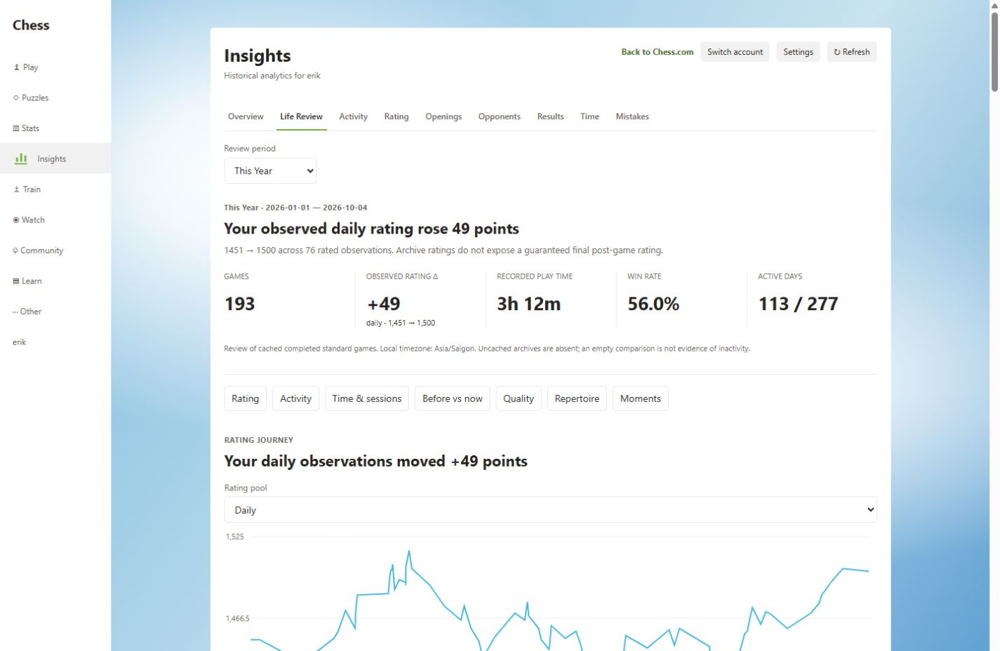
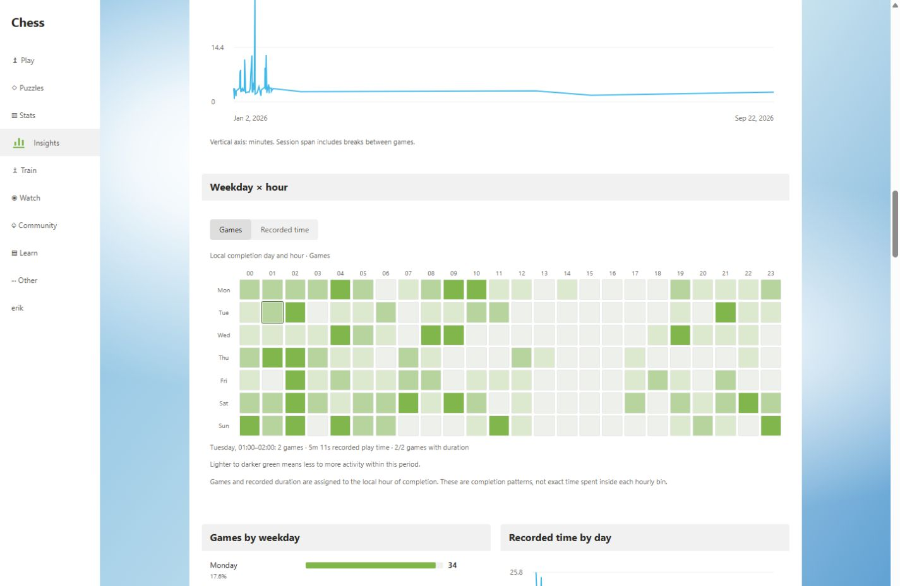
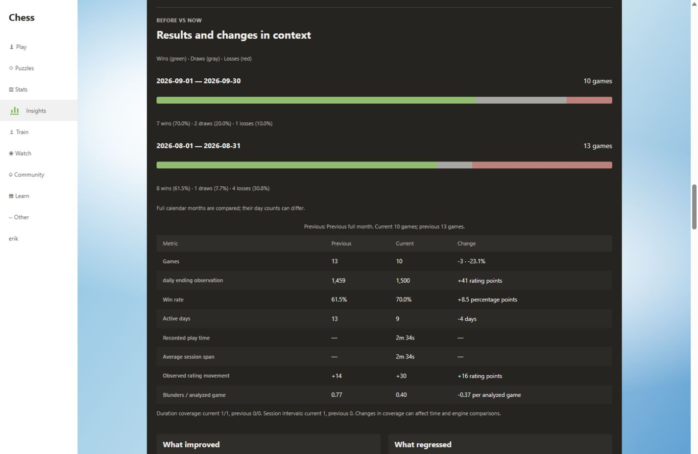

# Life Review — v0.1.12 candidate

Life Review is the ninth Insights tab, immediately after Overview. It reviews completed standard games in the existing local cache. It uses the same native sections, compact summary rows, green activity intensity, cyan trends, controls and light/dark themes as the other tabs. No account login, new server, AI service, chart framework or permission is added.

Open `/home#chess-insights/life-review`. Range links also retain `review`, `from`, `to` and `pool` query parameters. The page has its own review range; filters from other sections do not silently constrain it. Choosing a range loads relevant years from the available public archive index. All Time requests all available years. Counts can grow as those archives arrive; the page explicitly says it is reviewing cached history, not a proven complete account history.

## Included views

- Analytical summary and five primary metrics; deterministic evidence rules, neutral fallback for small samples.
- Pool-separated observed rating journey, first/last/high/low, maximum drawdown and within-day observed gains/losses.
- Existing calendar heatmap with Games, Time Played and Wins; days outside the selected window are visibly excluded. Daily, weekly or monthly game volume, active days and gaps.
- Recorded game time and existing 30-minute sessions, mean/median/longest span, games/session, session histogram and chronological timeline.
- Local completion-hour distribution, weekday × hour matrix with keyboard readouts, weekday volume and daily recorded minutes.
- Current/previous W/D/L bars and a compact comparison table with raw changes, relative percentages and percentage points distinguished.
- Compatible saved local engine coverage, blunders/mistakes/inaccuracies per analyzed game, severity counts and rate trends with missing months left as gaps. Viewing Life Review never queues Stockfish work.
- Pool, White/Black, opponent-strength and opening comparisons. Opening usage counts and share changes are descriptive; frequent rankings require eight games.
- Supported best/tough moments, capped chronological events and streaks with safe completed-game links.
- Calendar-day consistency distributions and variances, without an invented consistency score.
- Year at a Glance: monthly games, recorded hours, last rated observations, win rates, most active month and largest within-month observed gain.
- Native summary card and a self-contained SVG image export. Export stays on the device and does not publish anything.

## Dates and comparisons

The nine choices are This Week, This Month, Last Month, Last 30 Days, This Quarter, This Year, Last Year, All Time and Custom Range. Weeks begin Monday. Completion timestamps are converted to the current browser timezone; date inputs include their first and last day. Invalid or reversed custom dates show an error, and future custom endpoints are capped at today.

Current week/month/quarter/year compares the same elapsed calendar-day count in the preceding calendar period, through the same local wall-clock time on the final day. A shorter preceding period is capped at its end. Last Month and Last Year compare full calendar periods, whose lengths may differ. Last 30 Days and custom ranges compare immediately preceding equal calendar-day spans; a final day still in progress uses matching local time. All Time has no equivalent preceding period. Civil-day counting avoids treating DST days as fixed 24-hour intervals.

An empty cached previous period is not evidence that no chess was played then. The comparison text exposes boundaries, sample sizes and duration coverage. A refresh updates the captured review time; archive cache updates keep the selection and do not repeatedly request the same range.

## Metric contracts and limitations

| Metric                    | Meaning                                                                                                                                                                                                                                                                                                               |
| ------------------------- | --------------------------------------------------------------------------------------------------------------------------------------------------------------------------------------------------------------------------------------------------------------------------------------------------------------------- |
| Win rate                  | Wins ÷ completed games × 100. Draws are not wins.                                                                                                                                                                                                                                                                     |
| Score                     | (Wins + 0.5 × draws) ÷ games × 100. Not a performance rating.                                                                                                                                                                                                                                                         |
| Rating movement           | Last minus first rated observation in one pool; at least two observations. Archives expose pregame ratings, ordered here by completion, not guaranteed final postgame updates. Daily games can overlap.                                                                                                               |
| Daily rating movement     | Last minus first same-pool observation **within that day**, requiring two observations. Not attributed to a particular game or opening.                                                                                                                                                                               |
| Drawdown                  | Most negative observation minus the highest earlier observation in the selected pool.                                                                                                                                                                                                                                 |
| Active day / inactive gap | Local days with cached completed games / longest zero-game run inside the selected calendar window, including edge gaps.                                                                                                                                                                                              |
| Recorded time             | Existing fingerprint-validated PGN-header, clock or EMT duration of real-time games completed in the range. Full game durations can start before the range; Daily is excluded. Unknown durations are not nominal clock estimates.                                                                                     |
| Session                   | Existing exact start/end interval grouping with a 30-minute gap. Span includes breaks; recorded game time is separate. Missing intervals cannot bridge sessions.                                                                                                                                                      |
| Weekday/hour matrix       | Counts and recorded duration assigned to the **completion** day/hour. This does not imply all those seconds occurred inside that hour.                                                                                                                                                                                |
| Game variance             | Population variance of game counts across all selected calendar days, including zero-game days.                                                                                                                                                                                                                       |
| Time variance             | Population variance of recorded real-time seconds on fully covered real-time days plus inactive cached days. Partial/missing-duration active days and Daily-only days are excluded. UI converts to hours squared and retains small nonzero values.                                                                    |
| Engine rates              | Compatible saved error totals ÷ distinct analyzed selected games, including analyses with zero detected errors. Account, analysis version and duplicate mistakes are checked. Snapshots cannot independently revalidate old engine PGN fingerprints; these are saved compatible results, not newly verified analyses. |

Real Chess.com accuracy is absent from the current stored public-game model. Accuracy averages, best/lowest accuracy games, distributions and rating-versus-accuracy scatter plots are therefore explicitly unavailable. Local heuristic errors are never converted into a fake accuracy score. Evaluation history is insufficient for comeback or “lost after +5.3” claims. Per-opening and per-color postgame rating contribution is also unavailable; observed movement remains pool-specific.

Result comparisons used for improved/regressed conclusions require at least 10 games per period (8 per opening), at least a five-percentage-point difference, and nonoverlapping 95% Wilson intervals. These conservative descriptive checks are not causal inference or correction for all groups examined. Engine comparisons require at least 10 analyzed games per period, material absolute/relative movement and a count-noise guard; analysis selection and coverage remain caveated. No evidence means no conclusion.

Games are deduplicated by normalized ID, standard rules and valid completed timestamps/results; variants, unfinished/aborted normalization failures and future completions are excluded. Puzzle records are not part of this review. No database or engine format migration/reset is introduced.

## Verification on October 4, 2026

### Automatically/local fixture verified

Final local checks passed: ESLint, TypeScript, **455 tests in 63 files** (74 new Life Review tests), the independent data verifier (**1,399 comparisons in four timezones**), production build and release package verification. No new browser console warnings/errors were captured in the final chart check. The production package excludes the fixture and ships the existing local engine, licenses and corresponding Stockfish source.

The local candidate ZIP is `releases/chess-insights-v0.1.12.zip` (6,530,715 bytes). SHA-256: `01c2c21abf3b54df450cea90b119b6b57da14ab234c73c157490533b6238e32d`. The accompanying `releases/SHA256SUMS.txt` records the same checksum. `dist/manifest.json` reports `0.1.12 Release Candidate`. ZIP timestamps/checksums may differ when rebuilt; this checksum identifies the local verified archive.

Four new suites cover range edges, leap years, calendar lengths, custom bounds, local completion dates under UTC/Saigon/New York/Auckland, matched partial periods, W/D/L, rating extrema/daily changes, activity/gaps/streaks, existing sessions, missing duration, opening thresholds, opponent bins, moments, Wilson/noise rules, empty/optional data, safe links/XML export and accessible controls.

Integration checks use the real message-reading hook to preserve 100 existing saved analyses and a paused queue, while ensuring no engine enqueue/selection/clock request is made. Updating cached history advances counts without remounting Life Review or repeating its archive request. Refresh also advances the calendar cutoff when the archive fingerprint is unchanged, including month rollover. Existing pages retain their original error-recovery behavior.

A literal stress regression verifies 50,000 games, a 50,000-win run, 5,000 opening groups and a 1900–2026 custom range. One local Windows Node sample took approximately 333 ms for review aggregation and 591 ms for evidence grouping. These are local aggregation measurements, not browser frame/heap guarantees. Aggregations use maps, bounded pool groups and memoization; the longest-run calculation slices once rather than copying each growing streak. Lower sections use browser content visibility, and session detail can expand on demand.

The browser fixture uses the existing **erik PubAPI capture**, without Chess.com authentication. An independent Python count of its raw public games matched these rendered values in Asia/Saigon:

| Period                           | Games | Wins / draws / losses | Active days | Daily rating first → last |
| -------------------------------- | ----: | --------------------- | ----------: | ------------------------- |
| All cached history through Oct 4 |   193 | 108 / 8 / 77          |         113 | 1451 → 1500               |
| September                        |    10 | 7 / 2 / 1             |           9 | 1470 → 1500               |
| August                           |    13 | 8 / 1 / 4             |          13 | 1445 → 1459               |

September's 70.0% win rate versus August's 61.5% is displayed as **+8.5 percentage points**, not +8.5%. No improvement conclusion cleared the sample/evidence tests. The matrix readout for Tuesday 01:00–02:00 in the yearly capture showed two games, 5m 11s recorded and 2/2 duration coverage.

Local browser inspection covered light and dark at 375, 768, 1024 and 1440 px, with no document-level horizontal overflow; matrix/table scrolling stays inside their containers. All nine tabs were navigated without duplicate application roots, widget failure or new console errors. The visible SVG export action reported that the download started; the in-app browser did not expose a completed download event, so final file delivery in Edge remains a manual check. XML/image payload generation, escaping, theme selection and failure reporting are automated tests.

### Final manual verification in authenticated Edge

Load the built `dist/` using the **same existing extension directory/identity**, then reload the extension and Chess.com. Do not uninstall or clear storage. Confirm Life Review opens from Insights, existing saved analyses remain visible, ranges retain selections through Refresh, completed-game links open correctly, and Export summary card saves an SVG in your normal Edge profile. Check the real Chess.com sidebar/home mounting and browser update/restart behavior as described in the existing audit gates.

Authenticated DOM, production offscreen-engine delivery, clean-profile install/update and the earlier independent security scan are not claimed as verified by this fixture. The historical [v0.1.11 audit](../FINAL-AUDIT.md) remains unchanged; Life Review does not close those release gates or create a stable tag.
