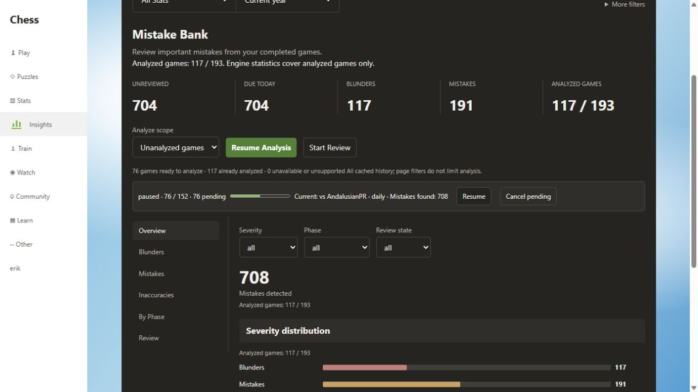
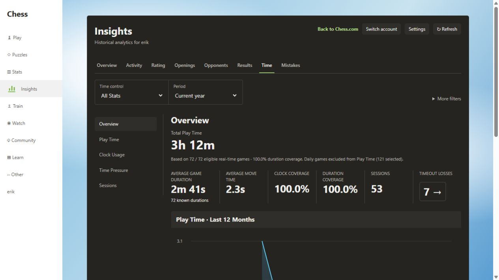

# v0.1.10 verification

## Root causes and corrections

In v0.1.9, the Mistakes button treated any ongoing archive synchronization as a prerequisite to analysis. A slow multi-year public archive fetch could leave “Loading history…” disabled even with usable cached games. The new flow allows cached eligible games to be analyzed during synchronization. Games downloaded after queue construction are available for the next batch; pending counts refresh automatically.

Every state poll also requested a complete PGN eligibility preview. The UI could not display saved results until that scan returned, and overlapping polls could replay newly deserialized archives repeatedly. Saved state now has a separate cheap request; eligibility has an independent, coalesced request with cached counts and exact source/player-aware replay reuse. Preview responses merge counts only, and older state responses cannot overwrite a newer queue action. Failed count checks show an error and retry.

A separate Resume race allowed a pre-start paused poll to close a newly owned engine host. Poll replies now check the host generation and startup state before stopping or orphan-checking it. The development fixture also mirrors production's initializing queue before loading the iframe, preventing cold module loads from being mistaken for a finished paused run.

“No games analyzed yet” is displayed only after storage has successfully loaded and no compatible account results exist. If the current year or pool hides results, the page reports the full saved account count and explains how to select All time / All Stats.

The database name, database version 4, analysis version 1, Stockfish 18.0.8 and 20,000-node budget are unchanged from the corresponding previous releases. No reset, migration rewrite, forced reanalysis, new permission or dependency is introduced. Exact stored results remain reused when their engine/settings/PGN match. A changed source or incompatible old result still requires new analysis.

The Time subtitle and both calculation-status rows are removed. Duration and clock parsing still run, and coverage remains available in the actual statistics.

## Automatically verified

- **349 tests in 46 files pass**, with TypeScript, ESLint, production-build and package verification. The complete local suite was run with one worker: the cold Vite transform test exceeded its 10-second HTTP timeout in two parallel runs, but passed independently and in the full serial run.

- A populated older-release database v3 with 125 games, **108 saved engine results and findings**, a review history and a paused 108/125 queue upgrades to v4 without losing records.
- Those 108 results can be read while the eligibility request is deliberately blocked. Selection then reports 108 analyzed and 17 pending; the new queue contains only those 17 and retains stored findings/reviews.
- Repeated unchanged preview requests share cached computation. Account/PGN/engine/node changes and newly synced archives refresh selection correctly.
- UI tests cover cached analysis enabled during history loading, an exhausted queue, honest initial loading, historical results hidden by filters, stale-state rejection, coalesced polling and stale preview isolation.
- The Time UI still renders cached totals while parsing proceeds without the removed subtitle or status rows.

## Local browser fixture verified

- The existing public `erik` fixture loaded **99 saved analyses and 601 findings** from the previous development run. A seven-day filter hiding all of them correctly reported 99 saved account results instead of an empty bank.
- Real bundled Stockfish resumed the existing queue at **58 / 152** and completed another **18 games**. The fixture then showed **117 / 193** analyzed games and 708 findings, with **76 / 152** queue completion and 76 pending. Pause, section navigation and reload retained those records and progress; the queue was deliberately left paused.
- The cleaned Time page showed cached totals without either parsing-progress row or the removed subtitle. These checks use public fixture games, not the user's Edge storage, and do not establish authenticated extension/offscreen integration.

## Final manual verification in authenticated Edge

The user's actual extension-origin database is not accessible from the development fixture. Automated preservation tests establish the upgrade behavior; they do not prove the contents of the user's Edge profile.

Reload the existing extension from the **same installed folder**, then reload Chess.com. On Mistakes, verify the previously analyzed account count; choose All time and All Stats if the current filters hide older games. Cached results should appear before archive synchronization finishes. Resume should retain a paused queue's progress. A fresh batch should include only eligible unanalyzed cached games. Newly downloaded games can enter the next batch.

Verify real extension/offscreen startup, pause/resume, and the cleaned Time page in the authenticated browser. Keep the original extension installed: uninstalling, clearing storage or loading a new folder/identity can make the original local records inaccessible. PubAPI cannot restore local Stockfish results if that storage was actually removed.
