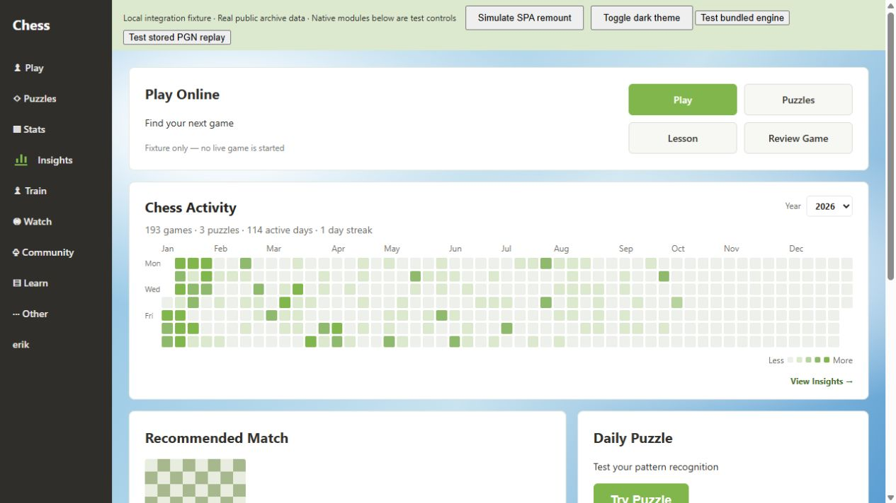

# Project QA — Chess Insights 0.1.6

The review covered data normalization/API/cache, analytics, DOM/navigation, React state, rated-puzzle tracking, local engine authorization/queue, clock/review behavior and release packaging. Reproducible failures were fixed and protected by regression tests. This report describes the verified scope; it does not claim that every possible Chess.com layout or future API change is covered.

## Automatically verified

- Baseline: 158 tests / 21 files. Final: **209 tests / 29 files**, including 51 additional regression tests.
- TypeScript and ESLint pass. Normal/debug builds and production ZIP checks pass.
- npm registry audit reports no known dependency vulnerabilities. No runtime dependency upgrade was needed; Node.js type definitions were added for packaging tests.
- A separate read-only review found no remaining blocking regression in the final diff.

| Area            | Reproduced problem                                                                                                | Corrected behavior / tests                                                                                                           |
| --------------- | ----------------------------------------------------------------------------------------------------------------- | ------------------------------------------------------------------------------------------------------------------------------------ |
| Homepage        | Removing only the heatmap caused a null-target crash; the observer ignored its removal                            | Restore layout before rediscovery and automatically remount one surface; DOM and observer tests                                      |
| Archive sync    | A waiting request inherited an earlier failure or lost `force`; UTC/local month mismatch and stale rollover cache | Independent queued requests, retained refresh intent, UTC month freshness and final refetch after cache settling; sync tests         |
| Storage/API     | Concurrent partial settings overwrote keys; malformed metadata and blocked upgrades left bad state                | Serialized writes, normalized error handling, valid Date/metadata checks and orphan-connection cleanup                               |
| Puzzle tracking | Clear/OFF raced with queued saves; hidden/stale results or changed IDs were counted                               | Ordered mutations, new tracking boundary, observed-session identity and visible completion evidence; account and refresh dedup tests |
| Account UI      | Old clear confirmation or failed cache load survived account change                                               | Reset confirmation, guard late replies and recover loading state                                                                     |
| Engine          | Reopening replaced a live lease; stale startup/cleanup/watchdog could overwrite Pause/Cancel or a new run         | Single lease, transactionally guarded queue writes, token-scoped cleanup and stop completion before restart                          |
| Reviews         | Concurrent grading lost history and double clicks graded twice                                                    | Serialized grading and busy-state UI                                                                                                 |
| Filters         | May 31 minus three months became March 3                                                                          | Clamp to February 28 rather than overflow into the next month                                                                        |
| Release         | Missing WASM/host/chunks or inconsistent versions could still yield a ZIP                                         | Release invokes the full build verifier; guard tests cover missing assets, debug builds, version mismatch and checksums              |
| Development     | Vite rejected importing the public manifest; its Windows watcher crashed while a release ZIP was being written    | Import the package version and exclude generated directories from watching; module transforms and post-pack server health verified   |

Tests use fake IndexedDB, controlled runtime/worker mocks, rendered React and realistic semantic DOM fixtures. Engine lifecycle mocks do not substitute for the browser's actual offscreen API.

## Browser fixture evidence

Only public `erik` archive records and synthetic rated-puzzle completions are used; the localhost database is separate from the installed extension's data.

- The bundled Stockfish WASM initialized, completed UCI/ready and returned an evaluation/best move for a test position.
- Overview, Activity, Rating, Openings, Opponents, Results, Time and Mistakes rendered without console errors or document horizontal overflow at 390px.
- At a 1280px viewport, the reported-grid fixture measured Play Online and heatmap at **1057px**, with matching left/right edges. Play ended at 598px, heatmap occupied 618–929.70px and both native cards began at 949.70px. One heatmap and one Insights item were present.
- The default fixture measured the same 1057px width: Play ended at 244px, heatmap occupied 260–571.70px and both cards began at 587.70px. Their combined outer width matched within 0.02px.
- A 390px fixture viewport measured a 241px Play/heatmap/card width with matching edges; document scroll width stayed below the viewport width.
- SPA remount preserved a single mount and native controls. Browser navigation through Train → Watch → Community retained one Insights item after each delayed menu reconciliation, and clicking it opened Overview. Additional automated tests cover menu replacement, mobile controls and repeated navigation.
- The homepage footer contains only the Insights link; detailed layout snapshots are debug-only.
- The development server still returned HTTP 200 for the layout module after production build/ZIP creation on Windows.

## Final manual scope in authenticated Edge/Chrome

The development browser cannot access the user's authenticated Edge profile. No extra login was requested. Actual Chess.com account detection, localized puzzle result/Next metadata, and the extension's real offscreen message delivery must be checked in the normal signed-in browser. The local fixture, full automated suite and real WASM worker do not prove those external integration details.

Use the existing extension directory, click Reload on its extension card and reload Chess.com. Verify one solved and one failed rated puzzle produce exactly two attempts, refresh does not duplicate them, OFF stops collection, and Clear affects only puzzle history. Analyze completed cached games, pause during initialization, resume, review one position and leave Mistakes. No engine assistance should appear on live games or puzzles.

Database version 3 and permissions are unchanged. Keep the same unpacked-extension directory/identity; do not uninstall or clear extension storage to upgrade. See [installation](INSTALL.md).
