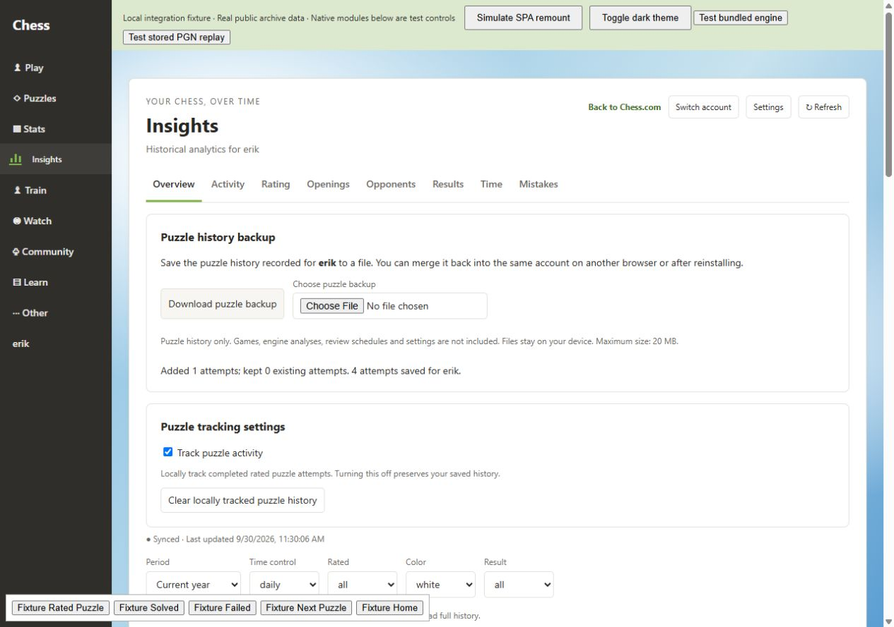
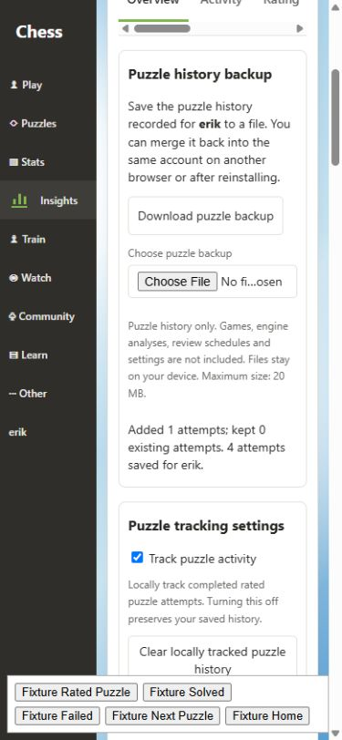

# QA — Chess Insights 0.1.7

This release adds local puzzle-history portability and filtered game CSV export, and fixes two reproduced Mistake Bank state bugs. Permissions and IndexedDB version 3 are unchanged.

## Automated verification

- **258 tests in 32 files pass**, including 49 new tests since 0.1.6. TypeScript, ESLint and the production build pass.
- A clean dependency install and repeat of all checks/build passed. The production ZIP contains the root manifest, runtime assets, installation guide, GPL notices and matching bundled Stockfish source; its SHA-256 checksum was verified.
- Backup validation covers account ownership, supported schema, calendar dates/timezones, timestamps, ratings, malformed files, conflicting IDs and the 20 MB / 50,000-attempt limits.
- IndexedDB tests verify additive/idempotent merge, concurrent live saves and imports, cross-account collisions, complete rollback after a later quota failure, preservation of unrelated stores, and tracking/Clear boundaries.
- Runtime-message tests verify import ordering with Clear/export, unchanged tracking OFF, failure recovery and update notifications.
- UI tests cover preview before import, wrong-account and oversized files, duplicate clicks, failed downloads/imports, account changes and restored dates before the live tracking boundary.
- CSV tests cover filtered selections, deterministic ordering, all 16 columns, null/zero values, Unicode, commas/quotes/newlines, UTF-8 BOM, formula-like text, download cleanup and stale export cancellation.
- Mistake Bank regressions reproduce primary Retry replacing an existing queue and delayed grading reopening a closed/replaced review. Retry now resumes pending work; review responses are scoped to the current session and restarting hides the old answer.
- A separate read-only review found no concrete release blocker in the integrated backup, coverage and review changes.

## Browser fixture verification

The local fixture uses public `erik` game records and synthetic puzzle attempts. It does not access the installed extension's storage or an authenticated Chess.com session.

- Downloaded and inspected a schema-1 JSON backup containing the three existing synthetic attempts and the correct account/version metadata.
- Selected a valid file through the browser file chooser. The preview displayed its account, attempt count and dates before any merge.
- Imported one older attempt: the total changed from 3 to 4, remained 4 after reloading, and the September 15 detail showed the restored record with an explicit incomplete-history note.
- Selected Daily + White from 193 cached games. Both the UI and the downloaded CSV contained **61 matching games**; the CSV was parsed independently to confirm every row's time class and color.
- The new settings initially overflowed at 390px because the file input's intrinsic width expanded the grid track. Constraining that track fixed the problem: document width **375px** at a **390px** viewport; backup content/input width **193px**. Desktop settings were checked at 1280px.
- No console errors were observed during the successful fixture workflow. The browser automation download event timed out, but the actual JSON and CSV files were verified in the browser's download directory.

## Final manual verification in authenticated Edge/Chrome

The real signed-in Chess.com DOM and extension offscreen/runtime transport remain outside this fixture's verified scope. No additional Chess.com login was requested. Previous homepage/sidebar integration regressions remain covered by the full automated suite; this release does not change their mount strategy.

After updating the same unpacked-extension directory and reloading the extension and website:

1. In Insights → Settings, download a puzzle backup, select that same file and merge it. The attempt total should stay unchanged, with existing entries skipped.
2. Export a filtered game CSV and confirm the displayed count matches the file.
3. Check the full-width homepage heatmap below Play Online and above Recommended Match + Daily Puzzle; navigate through Train/Watch and return through Insights.
4. Check one rated completion updates activity once, and historical-game analysis/review still works through the real offscreen host.

Backup files restore only records that were previously saved. They cannot recover unrecorded Chess.com puzzle history or engine analyses/review schedules. Keep the existing extension identity during upgrades; see [installation and restoration](INSTALL.md).
